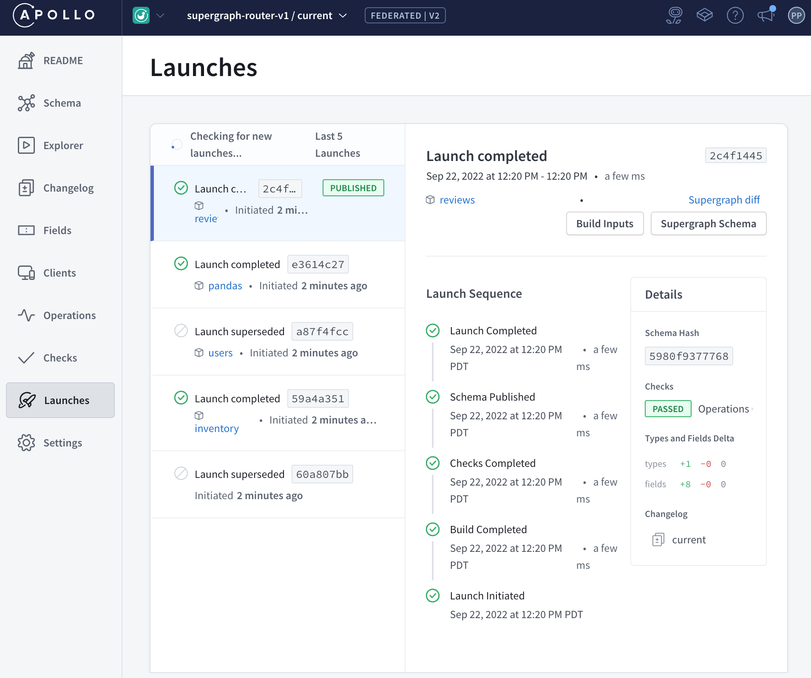
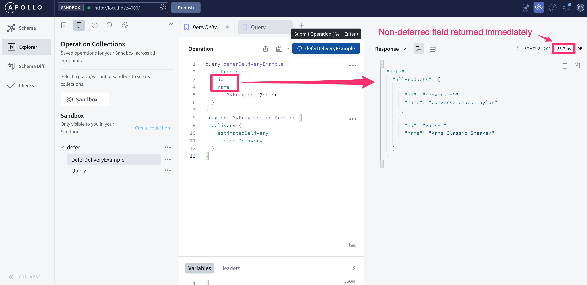
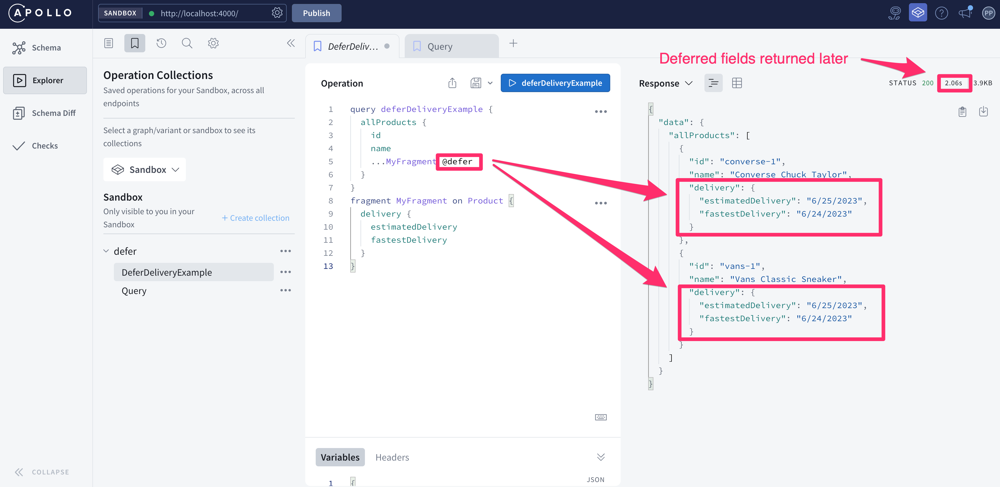
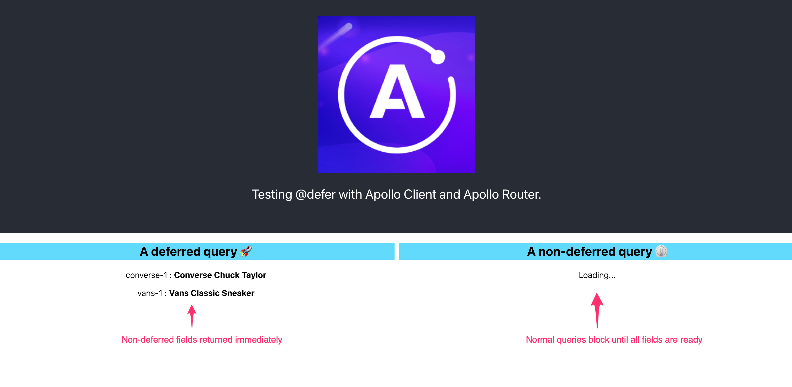
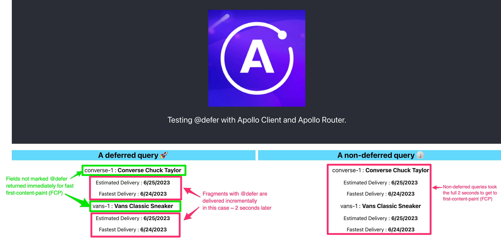
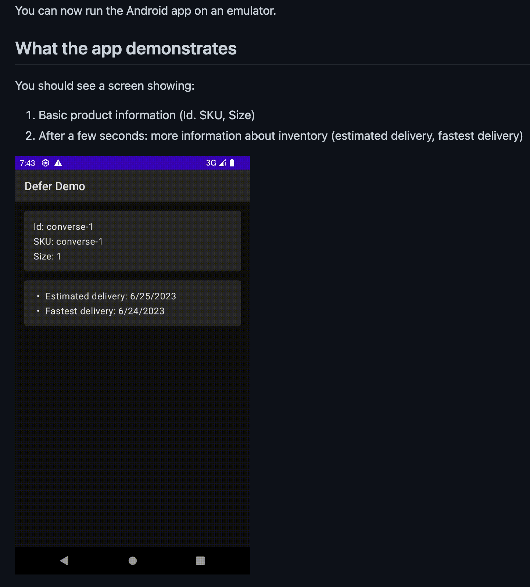

# Supergraph Demo for Federation 2


[](https://renovatebot.com)

> looking for the old supergraph-demo-fed2? It's over [here](https://github.com/apollographql/supergraph-demo-fed2/tree/pre-summit-2022)!

Federation 2 is an evolution of the original Apollo Federation with an improved shared ownership model, enhanced type merging, and cleaner syntax for a smoother developer experience. It’s backwards compatible, requiring no major changes to your subgraphs. Try the GA release today!

* [Welcome](#welcome)
* [Prerequisites](#prerequisites)
* [Build your first graph](#build-your-first-supergraph)
* [Composition in Apollo Studio](#composition-in-apollo-studio)
* [Local Development](#local-development)
* [Local Composition](#local-composition)
* [Open Telemetry](#open-telemetry)
* [Apollo Router - no code with YAML config](#apollo-router)
* [Apollo Router - pre-built Docker images](#apollo-router-pre-built-docker-images)
* [Apollo Router - entity-based `@defer`](#apollo-router-entity-based-defer)
* [Apollo Router - enhanced extensibility](#apollo-router---enhanced-extensibility)
* [Apollo Router - Rhai scripting](#apollo-router-rhai-scripting)
* [Apollo Router - native extensions in Rust](#apollo-router-rust-plugins)
* [Apollo Gateway](#apollo-gateway)
* [Composition examples](examples/composition/README.md)

## Welcome

Apollo Federation is an architecture for declaratively composing APIs into a
unified graph. Each team can own their slice of the graph independently,
empowering them to deliver autonomously and incrementally.


Designed in collaboration with the GraphQL community, Federation 2 is a
clean-sheet implementation of the core composition and query-planning engine at
the heart of Federation, to:

* **streamline common tasks** - like extending a type
* **simplify advanced workflows** - like migrating a field across subgraphs with no
downtime
* **improve the developer experience** - by adding
deeper static analysis, cleaner error messages, and new composition hints that
help you catch errors sooner and understand how your schema impacts performance.

**Federation 2** adds:

* first-class support for shared interfaces, enums, and other value types
* cleaner syntax for common tasks -- without the use of special keywords or directives
* flexible value type merging
* improved shared ownership for federated types
* deeper static analysis, better error messages and a new generalized composition model
* new composition hints let you understand how your schema impacts performance
* lots more!

**Apollo Router** is our next-generation supergraph runtime:

* no code required - run the stock binary with YAML config
* high performance graph router - low latency and high throughput
* secure by default - passed an independent security audit
* new `router --dev` mode for relaxed settings
* lightweight Rhai scripting to customize the stock Router image
* more native functionality, now with `@defer` support!
* OpenTelemetry tracing and metrics
* full support for Apollo Studio and it's supergraph CI/CD pipeline
* native extensions and a well-defined extensibility model
* lots more!

Learn more:

* [Announcing Apollo Router v1.0](https://www.apollographql.com/blog/announcement/backend/announcing-apollo-router-v1-0/)
* [Federation 2 is now generally available](https://www.apollographql.com/blog/announcement/backend/apollo-federation-2-is-now-generally-available/)
* [Federation docs](https://www.apollographql.com/docs/federation)
* [Community forum](http://community.apollographql.com/)

Let's get started!

## Prerequisites

You'll need:

* [docker](https://docs.docker.com/get-docker/) - builds subgraph images
* [docker-compose](https://docs.docker.com/compose/install/) - runs subgraphs locally
* [rover](https://www.apollographql.com/docs/rover/getting-started) - publishes subgraph schemas to your supergraph in the registry
* [router](https://www.apollographql.com/docs/router/getting-started) - pulls supergraph schemas from the registry

Install `rover` and `router`:

> Run the following `make` commands within the root project directory after you've cloned the repo.

```
make deps
```

## Quickstart

With the dependencies above installed and your supergraph's `APOLLO_KEY` and `APOLLO_GRAPH_REF` ready, you can deploy an entire supergraph with a single command:

> Run the following `make` commands within the root project directory after you've cloned the repo and installed the [prerequisites](#prerequisites).

```
make run-supergraph
```

`make run-supergraph` does the following:

* `make up-subgraphs` - deploys [subgraphs](/docker-compose.yaml) with `docker-compose`
* `make publish-subgraphs` - [adds subgraphs](https://www.apollographql.com/docs/rover/commands/subgraphs/#publishing-a-subgraph-schema-to-apollo-studio) to your supergraph
* `make run-router` - runs Apollo Router with a hot re-loading [uplink](https://www.apollographql.com/docs/federation/managed-federation/uplink/)

then in a separate window run:

```
make smoke
```

which issues several queries including those with new `@defer` support!

```
✅ ALL TESTS PASS!
```

open http://localhost:4000 to browse the schema and build queries

then shut down the `router` with `ctrl-c` and for the subgraphs:

```
make down
```

That's it!

If this is your first supergraph, let's get started below!

## Build your first supergraph

Supergraphs schemas are created by publishing subgraph schemas to the Apollo schema registry, typically when the subgraphs are ready to serve that schema as part of a supergraph.

Publishing subgraphs schemas to the Apollo schema registry does:

* supergraph CI - composes subgraphs into a supergraph
* supergraph CD - deploys supergraph schema to the Apollo Router

### Deploy your subgraphs first

> Run the following `make` commands within the root project directory after you've cloned the repo and installed the [prerequisites](#prerequisites).

```
make up-subgraphs
```

Which uses this [docker-compose.yaml](./docker-compose.yaml) to start the [subgraphs](./subgraphs/):

```
docker compose \
  -f docker-compose.yaml \
  -f opentelemetry/docker-compose.otel.yaml \
  up -d --build
```

With `docker compose logs` like this:

```
products    | 🚀 Products subgraph ready
users       | 🚀 Users subgraph ready
inventory   | Completed initialization in 712 ms
reviews     | INFO:     Application startup complete.
pandas      | 🚀 Pandas subgraph ready
```

Browse the products subgraph on port 4001: http://localhost:4001/


Localhost ports for subgraphs are listed in the [docker-compose.yaml](./docker-compose.yaml)

Now we need to create a supergraph in the Apollo schema registry, so we can publish our [subgraph](./subgraphs/) schemas into our supergraph!

### Sign up for a free Apollo Studio account

* [Create a free Apollo Studio account](https://studio.apollographql.com/welcome)
* Select `Register a deployed graph` (free forever)
* Create your user & org


### Create a graph following the prompts


* Enter the name for your graph
* Use the `Supergraph` architecture (default)
* Click Next


### Publish subgraphs to Apollo Studio

Once your subgraphs are running and a supergraph has been created in Apollo Studio, you can publish the [subgraph schemas](./subgraphs) to your supergraph in the Apollo Registry, where they will be composed into a supergraph schema.

```sh
make publish-subgraphs
```

`make publish-subgraphs` will prompt you for an `APOLLO_KEY` and `APOLLO_GRAPH_REF` that you can obtain from the screen above.

`make publish-subgraphs` then issues a `rover subgraph publish` for each subgraph with the `APOLLO_KEY` and `APOLLO_GRAPH_REF` to populate your supergraph for the first time.

```
---------------------------------------
subgraph: reviews
---------------------------------------
+ rover subgraph publish supergraph-router-v1@current --routing-url http://localhost:4005/graphql --schema subgraphs/reviews/reviews.graphql --name reviews --convert

Publishing SDL to supergraph-router-v1@current (subgraph: reviews) using credentials from the default profile.

A new subgraph called 'reviews' for the 'supergraph-router-v1@current' graph was created

The supergraph for the 'supergraph-router-v1@current' graph was updated with a new schema, composed from the updated 'reviews' subgraph

Monitor your schema delivery progress on on studio: https://studio.apollographql.com/graph/supergraph-router-v1/launches/2c4f1445-4166-4904-bfa3-806f0bc40514?variant=current
```

`rover subgraph publish` can be used by independent teams to publish their subgraphs as part of a larger supergraph. Subgraphs often live in separate VCS repos and `rover subgraph check` can be used in the CI for those repos.

### Schema Published Successfully


### View supergraph build results



### View unified API schema for apps to use


### Start your supergraph runtime

With our supergraph schema successfully composed in Studio we can start the **stock Apollo Router binary** with a minimal [router.yaml](/supergraph/router.yaml) config file.

*No code required!*

```
make run-router
```

`make run-router` does the following:

```
./router --dev -c ./supergraph/router.yaml --log info
```

which shows:


### Make a supergraph query

```sh
make query
```

which issues the following query that fetches across multiple subgraphs:

```ts
query Query {
  allProducts {
    id
    name
    sku
    createdBy {
      email
    }
  }
}
```

with results like:

```ts
{
  "data": {
    "allProducts": [
      {
        "id": "converse-1",
        "name": "Converse Chuck Taylor",
        "sku": "converse-1",
        "createdBy": {
          "email": "info@converse.com"
        }
      },
      {
        "id": "vans-1",
        "name": "Vans Classic Sneaker",
        "sku": "vans-1",
        "createdBy": {
          "email": "info@vans.com"
        }
      }
    ]
  }
}
```

### Query with Apollo Sandbox

http://localhost:4000/ has an embedded Sandbox in Apollo Router.

Apollo Sandbox helps you explore your supergraph and create queries using the query builder.

```ts
query Query {
  allProducts {
    id
    name
    sku
    createdBy {
      email
    }
  }
}
```


When you're done use `ctrl-c` to exit the `router`.

Then shutdown the subgraphs with:

```
make down
```

That's it!

## Composition in Apollo Studio

[Composition in Apollo Studio](https://www.apollographql.com/docs/federation/quickstart/studio-composition) enables multiple teams to independently publish their subgraph schemas after an updated subgraph has been deployed. Studio provides a supergraph CI/CD pipeline with schema checks that can assess the impact of a change using graph-native telemetry from your supergraph router. Composition in Apollo Studio supports basic composition and API [Contracts](https://www.apollographql.com/docs/studio/contracts/) which allows you to create slices of a unified graph (public API, partner API, internal API) for different consumers to use.

## Local Development

Doing local development with your own graph variant (like a branch in GitHub) enables you to see composition errors and browse your schema in Apollo Studio before deploying them to a production supergraph and provides a great developer experience.

Most of the examples in this repo use [Composition in Apollo Studio](https://www.apollographql.com/docs/federation/quickstart/studio-composition) which has some nice developer tooling that is [free for all Apollo users](https://www.apollographql.com/docs/studio/#free-for-all-apollo-users).

You can even use many of Studio's dev tools without an Apollo account using [Apollo Sandbox](https://www.apollographql.com/docs/studio/explorer/sandbox/). Apollo Router provides an embedded version of Sandbox using `router --dev` mode that can even show the query plans from the Router.


## Local Composition

Local composition using `rover supergraph compose` can be useful for simple local development use cases and air-gapped environments. In most cases [Composition in Apollo Studio](https://www.apollographql.com/docs/federation/quickstart/studio-composition) is preferred even for local development as newly published subgraphs are composed and automatically deployed to your local supergraph router which is listening for changes, so the supergraph automatically updates whenever you `rover subgraph publish` a new schema to the schema registry.

### Example: Local Composition

This shows how to use `rover supergraph compose` with Apollo Router

```
make run-supergraph-local
```

`make run-supergraph-local` does the following:

* `make up-subgraphs` - deploys [subgraphs](/docker-compose.yaml) with `docker-compose`
* `make config` - creates [supergraph.yaml](/examples/local/supergraph/localhost.yaml)
* `make compose` - composes a local [supergraph.graphql](/supergraph/schema/local.graphql)
* `make run-router-local` - runs Apollo Router with local supergraph


then in a separate window run:

```
make smoke
```

which issues several queries including those with new `@defer` support!

```
✅ ALL TESTS PASS!
```

open http://localhost:4000 to browse the schema and build queries

then shut down the `router` with `ctrl-c` and for the subgraphs:

```
make down
```

That's it!

## Open Telemetry

### Apollo Router support for distributed tracing & metrics

Apollo Router supports [Open Telemetry distributed tracing & metrics](https://www.apollographql.com/docs/router/configuration/metrics), with
enhanced Open Telemetry metrics and support for custom resources, labels, and attributes make the Router easier to operate at scale.

Built-in exporters for Prometheus, Jaeger, Zipkin, and Datadog are provided in addition to native support for the OpenTelemetry Protocol (OTLP) that enables [a wide variety of observability tooling](https://opentelemetry.io/vendors/) to work with Apollo Router.

To learn how to use OpenTelemetry (for standard request level metrics) in conjunction with Apollo Studio reporting (for graph-native telemetry with field-level resolution and insights) see the blog post on [Open Telemetry for Apollo Federation](https://www.apollographql.com/blog/backend/architecture/introducing-open-telemetry-for-apollo-federation/).

### Mac demo environments

If using Docker for Mac on your laptop, for the best experience:

* Docker for Mac 4.6.1+
* Enable these experimental features:
  * New Virtualization framework
  * VirtioFS accelerated directory sharing
* Mac Monterey 12.3+

### Example: Router support for OpenTelemetry

> All of the examples in this repo have Open Telemetry enabled and ready to use with a Zipkin trace viewer at http://localhost:9411.

#### Start a supergraph

```
make run-supergraph
```

#### Issues some queries

```
make smoke
```

#### Browse to Zipkin

[http://localhost:9411/](http://localhost:9411/)


#### Cleanup

shut down the `router` with `ctrl-c` and for the subgraphs:

```
make down
```

### Send OpenTelemetry traces to Honeycomb

You can send Open Telemetry from the Gateway to Honeycomb with the following [collector-config.yml](opentelemetry/collector-config.yml):

```
receivers:
  otlp:
    protocols:
      grpc:
      http:
        cors_allowed_origins:
          - http://*
          - https://*

exporters:
  otlp:
    endpoint: "api.honeycomb.io:443"
    headers:
      "x-honeycomb-team": "your-api-key"
      "x-honeycomb-dataset": "your-dataset-name"

service:
  pipelines:
    traces:
      receivers: [otlp]
      exporters: [otlp]
```


### View Metrics from Open Telemetry Spans using Prometheus

Once the cluster is up and has queries against it (via `make smoke`), browse to [http://localhost:9090/](http://localhost:9090/) and begin querying against metrics pulled from the trace spans.

Example queries:

* P95 by service: `histogram_quantile(.99, sum(rate(latency_bucket[5m])) by (le, service_name))`

* Average latency by service and operation (e.g. router/graphql.validate): `sum by (operation, service_name)(rate(latency_sum{}[1m])) / sum by (operation, service_name)(rate(latency_count{}[1m]))`

* RPM by service: `sum(rate(calls_total{operation="HTTP POST"}[1m])) by (service_name)`

### Learn More about Open Telemetry

* Docs: [Open Telemetry for Apollo Federation](https://www.apollographql.com/docs/federation/opentelemetry/)
* Docker compose file: [opentelemetry/docker-compose.otel.yaml](/opentelemetry/docker-compose.otel.yaml)
* Subgraph helper library: [supergraph-demo-opentelemetry](https://github.com/prasek/supergraph-demo-opentelemetry)
  * [subgraphs/products/products.js](subgraphs/products/products.js)
* Apollo Gateway:
  * [gateway/gateway.js](/supergraph/gateway/gateway.js)

## Apollo Router

[Apollo Router](https://www.apollographql.com/blog/announcement/backend/announcing-apollo-router-v1-0/) is our next-generation supergraph runtime that supports Apollo Federation (v1 or v2) — a declarative GraphQL architecture that lets you build and operate a modular GraphQL API. The supergraph runtime is what processes all of the incoming API requests from clients and routes them to the subgraphs that make up the overall supergraph.

### Router is the next-gen Gateway

As a Graph Router, the Apollo Router plays the same role as the Apollo Gateway. The same subgraph schemas and composed supergraph schema can be used in both the Router and the Gateway.

### Raw Performance

[Early benchmarks](https://www.apollographql.com/blog/announcement/backend/apollo-router-our-graphql-federation-runtime-in-rust) show that the Router adds less than 10ms of latency to each operation, and it can process 8x the load of the JavaScript Apollo Gateway.

### Router v1.0

The release of v1.0 takes Apollo Router beyond raw speed with optimizations for client app performance, hardened security, and robust extensibility.

* Entity-based `@defer` support in the Router mitigates slow services and works with existing subgraphs written in over 20 languages and frameworks, even if the server itself doesn’t support `@defer`.
* Apollo Router is now secure-by-default, has passed an independent security audit, and offers new security features like cross-site forgery protection.
* Enhanced YAML config and full Rhai scripting support make it simple to adapt the Router to your environment. Customize the Router even further with the stabilized native extension API.

### Learn More

* [Announcing Apollo Router v1.0](https://www.apollographql.com/blog/announcement/backend/announcing-apollo-router-v1-0/)
* [Docs](https://www.apollographql.com/docs/router/)
* [Quickstart](https://www.apollographql.com/docs/router/quickstart)
* [Migration Guide](https://www.apollographql.com/docs/router/migrating-from-gateway)
* [Pre-built Docker images and Helm charts](https://www.apollographql.com/docs/router/containerization/overview)

## Apollo Router Pre-Built Docker Images

Stock Router binaries are available for Linux, Mac, and Windows. We also ship [pre-built docker images](https://www.apollographql.com/docs/router/containerization/overview) and an [updated Helm chart](https://www.apollographql.com/docs/router/containerization/kubernetes). [Kubernetes examples](https://www.apollographql.com/docs/router/containerization/kubernetes) examples are also provided for use of `kustomize` and other Kubernetes tooling.

### Example: using the pre-built docker images

> `make` commands in this project starting with `up-` use `docker-compose up`

There are `docker-compose` examples using the pre-built docker images:

* [studio](/examples/studio/) - pulling supergraph schema from Apollo Studio
* [local](/examples/local/) - using local supergraph schemas

For example:

#### Start a supergraph

> Run the following `make` commands within the root project directory after you've cloned the repo and installed the [prerequisites](#prerequisites).

```
make up-supergraph
```

#### Issues some queries

```
make smoke
```

See that all is well:

```
✅ ALL TESTS PASS!
```

#### Cleanup

Everything can now be shut down with:

```
make down
```

## Apollo Router Entity-Based `@defer`

> This feature is currently in [preview](https://www.apollographql.com/docs/resources/product-launch-stages#preview), available in Apollo Router v1.0 and later. Learn about entity-based `@defer` in [the Router docs](https://www.apollographql.com/docs/router/executing-operations/defer-support).

### Faster app performance with entity-based @defer

Apps need to access essential data with as little latency as possible to improve performance benchmarks like first-content-paint (FCP), time-to-interactive (TTI), and total-blocking-time (TBT). Other less critical data can be returned slower and rendered incrementally while still keeping the user engaged.

However, since multiple REST APIs are often used to fetch data for a single GraphQL query, a single slow REST endpoint can bring an entire query to a halt. Hand tuning individual REST APIs may be needed for critical situations but are often hard to justify for typical roadmap features — leaving you with a difficult choice: slow app performance or slow feature delivery.

With Apollo Router v1.0, apps querying the supergraph can @defer the slow, non-essential parts of a request and have the most critical data returned immediately, with no backend changes to underlying services. The upgraded query planner in v1.0 uses [entities](https://www.apollographql.com/docs/federation/entities/) to fetch deferred fields from subgraphs and return them incrementally in a new multipart response format.

The best part? Because entity-based @defer is powered by the Router rather than subgraph servers, teams can continue using the same [subgraph languages and frameworks](https://www.apollographql.com/docs/federation/supported-subgraphs) they’re comfortable with and @defer just works, even if the subgraph server itself doesn’t offer @defer support.

Apollo Client and Sandbox support
App developers can add @defer to queries issued from Apollo Client and Apollo Sandbox and both will now automatically handle the deferred responses. Additionally, when using Sandbox with Apollo Router running locally in --dev mode, it will now show query plans to visualize how deferred queries are fetched.

Let's get started!

### Start a supergraph

> Run the following `make` commands within the root project directory after you've cloned the repo and installed the [prerequisites](#prerequisites).

```
make up-supergraph-defer
```

or alternatively
```
make up-supergraph-defer-local
```

Issue some queries to verify all is well:

```
make smoke
```

which shows:

```
✅ Introspection Success!
 - has @defer support

Running smoke tests ... 🚀 🚀 🚀

✅ ALL TESTS PASS!
```

### Example: Apollo Sandbox with entity-based `@defer` in the Router

Browse to http://localhost:4000 and issue the following query:

```
query deferDeliveryExample {
  allProducts {
    id
    name
    ...MyFragment @defer
  }
}
fragment MyFragment on Product {
    delivery {
      estimatedDelivery
      fastestDelivery
    }
  }
}
```

this will display the non-deferred content immediately:



and display the deferred query fragments ~ 2 seconds later:


you can now also view local query plans from Apollo Router in Sandbox:


You can also use `@defer` with inline fragments:

```
query DeferDeliveryExampleInline {
  allProducts {
    ... on Product @defer {
      delivery {
        estimatedDelivery
        fastestDelivery
      }
    }
    sku
    id
  }
}
```

### Example: Apollo Client with entity-based `@defer` in the Router

> ⚠️ The @defer directive is currently at the [preview stage](https://www.apollographql.com/docs/resources/release-stages/#preview) in Apollo Client, and is available by installing @apollo/client@next. If you have feedback on it, please let us know via [GitHub issues](https://github.com/apollographql/apollo-client/issues/new?assignees=&labels=&template=bug.md).

[The code](/client/defer/apollo-client/) for this example should already be running via this [docker-compose.yaml](/client/defer/apollo-client/docker-compose.yaml) as part of `make up-supergraph-defer`.

http://localhost:3000 shows the deferred query in action.

Non-deferred query fields render immediately:



and display the deferred query fragments ~ 2 seconds later:



### Example: Apollo Kotlin with entity-based `@defer` in the Router

> ⚠️ The @defer directive is currently [experimental](https://www.apollographql.com/docs/resources/release-stages/#experimental-features) in Apollo Kotlin and enabled for use by default. If you have feedback on it, please let us know via [GitHub issues](https://github.com/apollographql/apollo-android/issues/new?assignees=&labels=Type%3A+Bug&template=bug_report.md&title=%5BDefer%20Support%5D) or in the [Kotlin Slack community](https://slack.kotl.in/).

Checkout this Apollo Kotlin `@defer` demo app:

[https://github.com/BoD/DeferDemo](https://github.com/BoD/DeferDemo)



### Cleanup

When done, shut everything down with:

```
make down
```

### Compatibility Test Suite for `@defer`

Entity-based `@defer` integration tests:

* [Apollo Client + Apollo Router e2e tests](https://github.com/apollographql/apollo-client/issues)
* [Apollo Kotlin + Apollo Router e2e tests](https://github.com/apollographql/apollo-kotlin/blob/main/tests/defer/src/commonTest/kotlin/test/DeferWithRouterTest.kt)

## Apollo Router - Enhanced Extensibility

As the Router has been rolled out into more environments we’ve learned about the right integration points and customizations to make the Router work well:

*No code required* - Apollo ships a standalone Router binary that can be configured using a [YAML config file](https://www.apollographql.com/docs/router/configuration/overview#yaml-config-file) with a new stable v1 configuration schema for things like header forwarding and CORS configuration. Many new features are available in YAML config like [traffic shaping support](https://www.apollographql.com/docs/router/configuration/traffic-shaping/) for rate limiting, query deduplication, configurable timeouts and compression. YAML config is a great way to get started with the stock Router binary and is sufficient for many environments.

*Lightweight Rhai scripting* - New official support for [Rhai scripting](https://www.apollographql.com/docs/router/customizations/rhai) and a [stable v1 API](https://www.apollographql.com/docs/router/customizations/rhai-api/) offers a safe and sandboxed way to customize the request flow. Rhai is ideal for common scripting tasks like manipulating strings, processing headers, and mutating request context. Checkout the [growing cookbook of example scripts](https://github.com/apollographql/router/tree/main/examples) that can be used with the stock Router binary.

*Native extensions* - With v1.0 we have stabilized all key extension points in the [native extension API](https://www.apollographql.com/docs/router/customizations/native) and enabled more powerful schema-driven extensions to be built using [Apollo’s new Rust tooling for GraphQL](https://www.apollographql.com/blog/announcement/tooling/apollo-rs-graphql-tools-in-rust/). Much of the Router itself is built as native extensions that can be used via standard YAML config and Rhai scripting. Native extensions are a good choice when Rhai scripting is not enough and for advanced use cases.

Our goal over time is to identify common customizations and elevate them into standard Router features, so let us know if you have a Router customization or idea that others in the community could benefit from!

## Apollo Router Rhai Scripting

*Lightweight Rhai scripting* - New official support for [Rhai scripting](https://www.apollographql.com/docs/router/customizations/rhai) and a [stable v1 API](https://www.apollographql.com/docs/router/customizations/rhai-api/) offers a safe and sandboxed way to customize the request flow. Rhai is ideal for common scripting tasks like manipulating strings, processing headers, and mutating request context. Checkout the [growing cookbook of example scripts](https://github.com/apollographql/router/tree/main/examples) that can be used with the stock Router binary.

Which uses this [test.rhai](/supergraph/router-rhai-script/test.rhai) script:

```rust
// At the supergraph_service stage, register callbacks for processing requests
fn supergraph_service(service) {
    const request_callback = Fn("process_request"); // This is standard Rhai functionality for creating a function pointer
    service.map_request(request_callback); // Register the callback
}

// Generate a log for each request
fn process_request(request) {
    let start = apollo_start.elapsed;
    // ... Do some processing
    let duration = apollo_start.elapsed - start;
    log_info(`custom processing took: ${duration}`);
}        
```

### Example: Rhai Script

#### Start a supergraph

> Run the following `make` commands within the root project directory after you've cloned the repo and installed the [prerequisites](#prerequisites).

```
make run-supergraph-rhai
```

#### Issues some queries

```
make smoke
```

#### Observe the custom `rhai_info` logging


#### Cleanup

shut down the `router` with `ctrl-c` and for the subgraphs:

```
make down
```

## Apollo Router Rust Plugins

*Native extensions* - With v1.0 we have stabilized all key extension points in the [native extension API](https://www.apollographql.com/docs/router/customizations/native) and enabled more powerful schema-driven extensions to be built using [Apollo’s new Rust tooling for GraphQL](https://www.apollographql.com/blog/announcement/tooling/apollo-rs-graphql-tools-in-rust/). Much of the Router itself is built as native extensions that can be used via standard YAML config and Rhai scripting. Native extensions are a good choice when Rhai scripting is not enough and for advanced use cases.

### Prerequisites

* [Rust](https://www.rust-lang.org/tools/install) - for fast local incremental Router builds with native extensions

### Example: Native Router extension in Rust

The [router-rust-plugin](/supergraph/router-rust-plugin/) example is based on the [hello-world example](https://github.com/apollographql/router/tree/main/examples/hello-world).

Config settings for the `Plugin` are defined in the [router.yaml](/supergraph/router-rust-plugin/router.yaml)

```yaml
plugins:
  example.hello_world:
    name: "Bob"
```

Note the plugin gets registered in [the code](/supergraph/router-rust-plugin/src/hello_world.rs) below like this:
```rust
register_plugin!("example", "hello_world", HelloWorld);
```

Which can then be used in the the `Plugin` like this:

```rust
#[async_trait::async_trait]
impl Plugin for HelloWorld {
    type Config = Conf;

    async fn new(init: PluginInit<Self::Config>) -> Result<Self, BoxError> {
        Ok(HelloWorld {
            configuration: init.config,
        })
    }

    fn supergraph_service(&self, service: supergraph::BoxService) -> supergraph::BoxService {
        #[cfg(test)]
        println!("Hello {}", self.configuration.name);
        #[cfg(not(test))]
        tracing::info!("Hello {}", self.configuration.name);
        // building blocks for your plugin.
        ServiceBuilder::new()
            // .map_request()
            // .map_response()
            // .rate_limit()
            // .checkpoint()
            // .timeout()
            .service(service)
            .boxed()
    }
}

// In order to keep the plugin names consistent,
// we use using the `Reverse domain name notation`
register_plugin!("example", "hello_world", HelloWorld);
```

#### Run a supergraph

> Run the following `make` commands within the root project directory after you've cloned the repo and installed the [prerequisites](#prerequisites).

```
make run-supergraph-rust-plugin
```

This will build a custom `acme_router` binary:


#### Make some queries

```
make smoke
```

#### Observe the custom `Hello Bob` log messages


#### Cleanup

shut down the `router` with `ctrl-c` and for the subgraphs:

```
make down
```

### Learn more

* [Router Docs: Native Rust Plugins](https://www.apollographql.com/docs/router/customizations/native)
* [Router Examples](https://github.com/apollographql/router/tree/main/examples)

## Apollo Gateway

There are `docker-compose` examples using the pre-built docker images:

* [studio](/examples/studio/) - pulling supergraph schema from Apollo Studio
* [local](/examples/local/) - using local supergraph schemas

> `make` commands in this project starting with `up-` use `docker-compose up`

For example:

#### Start a supergraph using Apollo Gateway

> Run the following `make` commands within the root project directory after you've cloned the repo and installed the [prerequisites](#prerequisites).

```
make up-supergraph-gateway
```

#### Issues some queries

```
make smoke
```

See that all is well:

```
✅ ALL TESTS PASS!
```

#### Cleanup

Everything can now be shut down with:

```
make down
```

## Troubleshooting

### No space left on device

If you get an error like `No space left on device`:

```
#0 33.67 FAILURE: Build failed with an exception.
#0 33.67
#0 33.67 * What went wrong:
#0 33.67 A problem occurred configuring root project 'app'.
#0 33.67 > Could not resolve all files for configuration ':classpath'.
#0 33.68    > Could not download kotlin-compiler-embeddable-1.7.10.jar (org.jetbrains.kotlin:kotlin-compiler-embeddable:1.7.10)
#0 33.68       > Could not get resource 'https://plugins.gradle.org/m2/org/jetbrains/kotlin/kotlin-compiler-embeddable/1.7.10/kotlin-compiler-embeddable-1.7.10.jar'.
#0 33.68          > No space left on device
#0 33.68
```

run `make docker-prune` to free up space:
```
make docker-prune
```

which does:
```
docker image prune -f
docker kill $(docker ps -aq)
docker rm $(docker ps -aq)
docker volume rm $(docker volume ls -qf dangling=true)
```

then retry the command you were originally trying to execute.

## More on Federation 2

* [Blog Post](https://www.apollographql.com/blog/announcement/backend/announcing-apollo-router-v1-0/)
* [Docs](https://www.apollographql.com/docs/federation/v2)
* [GitHub](https://github.com/apollographql/federation)
* [Community Forum](http://community.apollographql.com/) -- we'd love to hear what you think!

## More on Apollo Router

* [Blog Post](https://www.apollographql.com/blog/announcement/backend/apollo-router-our-graphql-federation-runtime-in-rust/)
* [Docs](https://www.apollographql.com/docs/router/)
* [GitHub](https://github.com/apollographql/router)
* [Discussions](https://github.com/apollographql/router/discussions) -- we'd love to hear what you think!
* [Community Forum](http://community.apollographql.com/)
