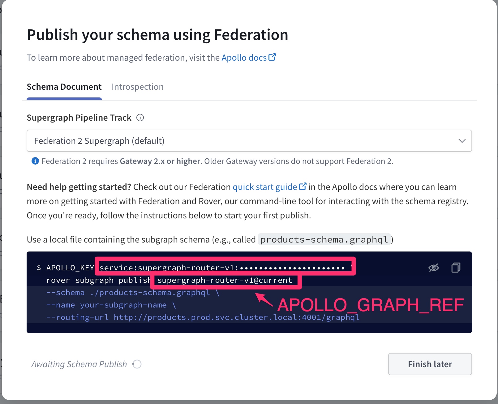
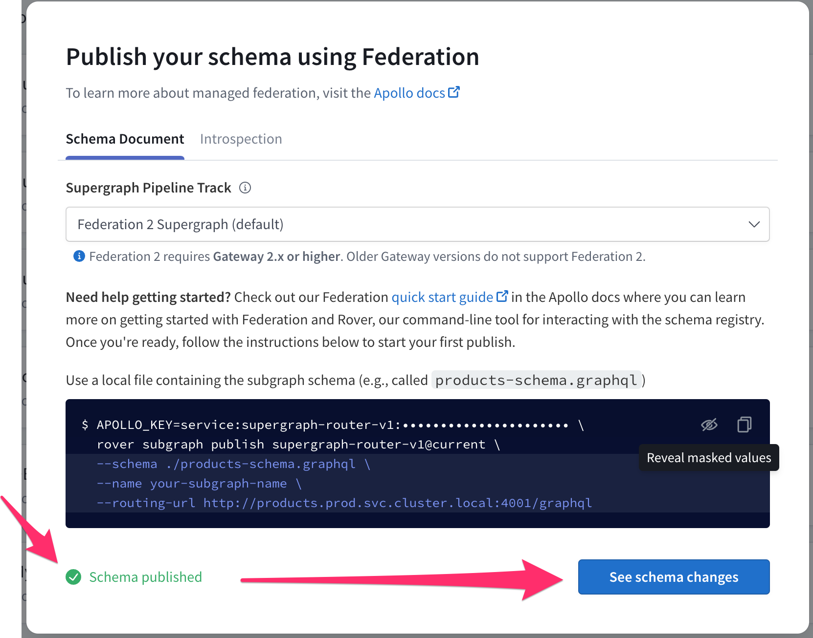
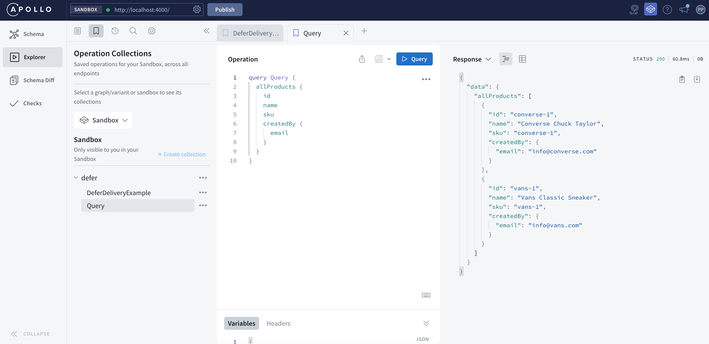
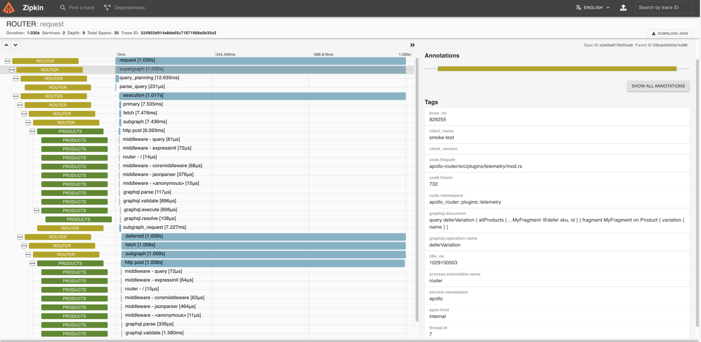

# Supergraph Demo for Federation 2


[](https://renovatebot.com)

Federation 2 is an evolution of the original Apollo Federation with an improved shared ownership model, enhanced type merging, and cleaner syntax for a smoother developer experience. It’s backwards compatible, requiring no major changes to your subgraphs. Try the GA release today!

* [Welcome](#welcome)
* [Prerequisites](#prerequisites)
* [Build your first graph](#build-your-first-graph-with-federation-2)
* [Local development](#local-development-with-federation-2)
* [Open Telemetry](#tracing-with-open-telemetry)
* [Composition examples](examples/README.md)
* [Apollo Router](#apollo-router)
* [Apollo Router Custom Plugin](#apollo-router-custom-plugin)

## Welcome

Apollo Federation is an architecture for declaratively composing APIs into a
unified graph. Each team can own their slice of the graph independently,
empowering them to deliver autonomously and incrementally.


Designed in collaboration with the GraphQL community, Federation 2 is a
clean-sheet implementation of the core composition and query-planning engine at
the heart of Federation, to:

* **streamline common tasks** - like extending a type
* **simplify advanced workflows** - like migrating a field across subgraphs with no
downtime
* **improve the developer experience** - by adding
deeper static analysis, cleaner error messages, and new composition hints that
help you catch errors sooner and understand how your schema impacts performance.

Federation 2 adds:

* first-class support for shared interfaces, enums, and other value types
* cleaner syntax for common tasks -- without the use of special keywords or directives
* flexible value type merging
* improved shared ownership for federated types
* deeper static analysis, better error messages and a new generalized composition model
* new composition hints let you understand how your schema impacts performance
* lots more!

Learn more:

* [Blog Post](https://www.apollographql.com/blog/announcement/backend/announcing-federation-2/)
* [Docs](https://www.apollographql.com/docs/federation/v2)
* [Community Forum](http://community.apollographql.com/)

Let's get started!

## Prerequisites

You'll need:

* [docker](https://docs.docker.com/get-docker/)
* [docker-compose](https://docs.docker.com/compose/install/)
* `rover` [the CLI for managing graphs](https://www.apollographql.com/docs/rover/getting-started)

To install `rover`:

```sh
curl -sSL https://rover.apollo.dev/nix/v0.5.0 | sh
```

For help with `rover` see [installing the Rover CLI](https://www.apollographql.com/docs/federation/v2/quickstart/#1-install-the-rover-cli).

## Build your first graph with Federation 2

### Sign up for a free Apollo Studio account

* [Create a free Apollo Studio account](https://studio.apollographql.com/welcome)
* Select `Register a deployed graph` (free forever)
* Create your user & org

### Create a graph following the prompts


* Follow the prompt to add your first graph with the `Deployed` option selected and the `Supergraph` architecture selected.
* Click Next



### Publish subgraphs to Apollo Studio

Then publish the 3 [subgraph schemas](./subgraphs) to the registry in Apollo Studio.

```sh
# build a supergraph from 3 subgraphs: products, users, inventory
make publish
```

It will prompt you for your `APOLLO_KEY` and your `APOLLO_GRAPH_REF` that you can obtain from the screen above.

The subgraph will be published to the Apollo Registry:

```
---------------------------------------
subgraph: pandas
---------------------------------------
+ rover subgraph publish My-Graph-3-vh40el@current --routing-url http://pandas:4000/graphql --schema subgraphs/pandas/pandas.graphql --name pandas --convert
Publishing SDL to My-Graph-3-vh40el@current (subgraph: pandas) using credentials from the default profile.

A new subgraph called 'pandas' for the 'My-Graph-3-vh40el@current' graph was created

The gateway for the 'My-Graph-3-vh40el@current' graph was updated with a new schema, composed from the updated 'pandas' subgraph

Monitor your schema delivery progress on on studio: https://studio.apollographql.com/graph/My-Graph-3-vh40el/launches/5bbeb91e-c6bd-4fdf-b8af-5c330f26d618?variant=current
```

### Schema Published Successfully!



Click See schema changes

### View supergraph build results


### View unified API schema for apps to use


### Start the v2 Gateway and issue a query

Now that Federation 2 is enabled we can start a v2 Gateway that uses the graph composed by Apollo Studio.

This can be done with a single command, or step by step with the instructions that follow:

```
make demo
```

`make demo` does the following things:

#### Starts the v2 Gateway and 3 subgraph services

```
make docker-up
```

this uses `docker-compose.managed.yml`:

```yaml
version: '3'
services:
  apollo-gateway:
    container_name: apollo-gateway
    build: ./gateway
    env_file: # created automatically during `make publish`
      - graph-api.env
    ports:
      - "4000:4000"
  products:
    container_name: products
    build: ./subgraphs/products
  inventory:
    container_name: inventory
    build: ./subgraphs/inventory
  users:
    container_name: users
    build: ./subgraphs/users
```

which shows:

```
docker-compose -f docker-compose.managed.yml up -d
Creating network "supergraph-demo_default" with the default driver
Creating apollo-gateway ... done

Starting Apollo Gateway in managed mode ...
Apollo usage reporting starting! See your graph at https://studio.apollographql.com/graph/supergraph-router@dev/
🚀 Server ready at http://localhost:4000/
```

#### Make a Federated Query

```sh
make query
```

which issues the following query that fetches across 3 subgraphs:

```ts
query Query {
  allProducts {
    id
    sku
    createdBy {
      email
      totalProductsCreated
    }
  }
}
```

with results like:

```ts
{
  data: {
    allProducts: [
      {
        id: "apollo-federation",
        sku: "federation",
        createdBy: {
          email: "support@apollographql.com",
          totalProductsCreated: 1337
        }
      },{
        id: "apollo-studio",
        sku: "studio",
        createdBy:{
          email: "support@apollographql.com",
          totalProductsCreated: 1337
        }
      }
    ]
  }
}
```

#### Query using Apollo Explorer

Apollo Explorer helps you explore the schemas you've published and create queries using the query builder.



Getting started with Apollo Explorer:

1. Ensure the graph we previously started with `make docker-up` is still running
1. Configure Explorer to use the local v2 Gateway running on [http://localhost:4000/](http://localhost:4000/)
1. Use the same query as before, but this time in Apollo Explorer:

```ts
query Query {
  allProducts {
    id
    sku
    createdBy {
      email
      totalProductsCreated
    }
  }
}
```

Once we're done we can shut down the v2 Gateway and the 3 subgraphs:

```
docker-compose down
```

That's it!

## Local Development with Federation 2

This section assumes you have `docker`, `docker-compose` and the `rover` core binary installed from the [Prerequisites](#prerequisites) sections above.

### Local Supergraph Composition

See also: [Apollo Federation docs](https://www.apollographql.com/docs/federation/v2/quickstart/)

You can federate multiple subgraphs into a supergraph using:

```sh
make demo-local
```

which does the following:

```sh
# build a supergraph from 3 subgraphs: products, users, inventory
make supergraph
```

which runs:

```
rover supergraph compose --config ./supergraph.yaml > supergraph.graphql
```

and then runs:

```
make docker-up-local

Creating apollo-gateway ... done
Creating inventory      ... done
Creating users          ... done
Creating products       ... done

Starting Apollo Gateway in local mode ...
Using local: supergraph.graphql
🚀 Graph Router ready at http://localhost:4000/
```

`make demo-local` then issues a curl request to the graph router via:

```sh
make query
```

which issues the following query that fetches across 3 subgraphs:

```ts
query Query {
  allProducts {
    id
    sku
    createdBy {
      email
      totalProductsCreated
    }
  }
}
```

with results like:

```ts
{
  data: {
    allProducts: [
      {
        id: "apollo-federation",
        sku: "federation",
        createdBy: {
          email: "support@apollographql.com",
          totalProductsCreated: 1337
        }
      },{
        id: "apollo-studio",
        sku: "studio",
        createdBy:{
          email: "support@apollographql.com",
          totalProductsCreated: 1337
        }
      }
    ]
  }
}
```

`make demo-local` then shuts down the graph router:

```
docker-compose down
```

### Apollo Sandbox for Local Development

#### Deploy Graph

```
make docker-up-local
```

#### Query using Apollo Sandbox

1. Open [http://localhost:4000/](http://localhost:4000/)
2. Click `Query your server`
3. Run a query:

```ts
query Query {
  allProducts {
    id
    sku
    createdBy {
      email
      totalProductsCreated
    }
  }
}
```

View results:


#### Cleanup

```
docker-compose down
```

### Tracing with Open Telemetry

To see where time is being spent on a request we can use [Open Telemetry Distributed Tracing for Apollo Federation](https://www.apollographql.com/blog/backend/architecture/introducing-open-telemetry-for-apollo-federation/).

#### Deploy Graph with Open Telemetry Collector

```
make docker-up-otel-collector
```

#### Run Queries

```
make smoke
```

#### View Open Telemetry Traces in Zipkin

browse to [http://localhost:9411/](http://localhost:9411/)



#### Cleanup

```
make docker-down-otel-collector
```

#### Send Open Telemetry Traces to Honeycomb

You can send Open Telemetry from the Gateway to Honeycomb with the following [collector-config.yml](opentelemetry/collector-config.yml):

```
receivers:
  otlp:
    protocols:
      grpc:
      http:
        cors_allowed_origins:
          - http://*
          - https://*

exporters:
  otlp:
    endpoint: "api.honeycomb.io:443"
    headers:
      "x-honeycomb-team": "your-api-key"
      "x-honeycomb-dataset": "your-dataset-name"

service:
  pipelines:
    traces:
      receivers: [otlp]
      exporters: [otlp]
```


#### Learn More about Open Telemetry

* Docs: [Open Telemetry for Apollo Federation](https://www.apollographql.com/docs/federation/opentelemetry/)
* Docker compose file: [docker-compose.otel-collector.yml](docker-compose.otel-collector.yml)
* Helper library: [supergraph-demo-opentelemetry](https://github.com/prasek/supergraph-demo-opentelemetry)
  * See usage in:
    * [gateway/gateway.js](gateway/gateway.js)
    * [subgraphs/products/products.js](subgraphs/products/products.js)

## Apollo Router

[The Apollo Router](https://www.apollographql.com/blog/announcement/backend/apollo-router-our-graphql-federation-runtime-in-rust) is our next-generation GraphQL Federation runtime written in Rust, and it is fast.

As a Graph Router, the Apollo Router plays the same role as the Apollo Gateway. The same subgraph schemas and composed supergraph schema can be used in both the Router and the Gateway.

This demo shows using the Apollo Router with a Federation 2 supergraph schema, composed using the Fed 2 `rover supergraph compose` command. To see the Router working with Federation 1 composition, checkout the Apollo Router section of [apollographql/supergraph-demo](https://github.com/apollographql/supergraph-demo/blob/main/README.md#apollo-router).

[Early benchmarks](https://www.apollographql.com/blog/announcement/backend/apollo-router-our-graphql-federation-runtime-in-rust) show that the Router adds less than 10ms of latency to each operation, and it can process 8x the load of the JavaScript Apollo Gateway.

See the [Apollo Router Docs](https://www.apollographql.com/docs/router/) for details.

### Router with Managed Federation

```
make demo-router
```

which uses this [docker-compose.router-managed.yml](docker-compose.router-managed.yml) file:

```yaml
version: '3'
services:
  apollo-router:
    container_name: apollo-router
    image: ghcr.io/apollographql/router:v0.1.0-preview.7
    volumes:
      - ./router.yaml:/dist/config/router.yaml
    command: [ "-c", "config/router.yaml", "--log", "info" ]
    env_file: # create with make graph-api-env
      - graph-api.env
    ports:
      - "4000:4000"
  products:
    container_name: products
    build: ./subgraphs/products
  inventory:
    container_name: inventory
    build: ./subgraphs/inventory
  users:
    container_name: users
    build: ./subgraphs/users
  pandas:
    container_name: pandas
    build: ./subgraphs/pandas
```

which uses the published Router docker image created from this [Dockerfile](https://github.com/apollographql/router/blob/main/dockerfiles/Dockerfile.router)

### Router with Local Development

Prerequisites: [Local development](#local-development-with-federation-2)

```
make demo-local-router
```

which uses this [docker-compose.router.yml](docker-compose.router.yml) file

### Router with Open Telemetry

Similar to [Open Telemetry with the Gateway](#tracing-with-open-telemetry)

If using Docker for Mac to try on your laptop, for the best experience:

* Docker for Mac 4.6.1+
* Enable these experimental features:
  * New Virtualization framework
  * VirtioFS accelerated directory sharing
* Mac Monterey 12.3+

#### Deploy Graph with Open Telemetry Collector

```
make docker-up-router-otel
```

#### Run Queries

```
make load
```

#### View Open Telemetry Traces in Zipkin

browse to [http://localhost:9411/](http://localhost:9411/)

#### Cleanup

```
make docker-down-router
```

## Apollo Router Custom Plugin

Docs and examples:

* [Router Docs: Native Rust Plugins](https://www.apollographql.com/docs/router/customizations/native)
* [Router Examples](https://github.com/apollographql/router/tree/main/examples)

This is based on the [hello-world native Rust plugin example](https://github.com/apollographql/router/tree/main/examples/hello-world).

The [router](router) folder in this repo has the contents of the custom Router docker image used in the steps below.

```
git clone git@github.com:apollographql/supergraph-demo-fed2.git
cd supergraph-demo-fed2

make docker-build-router
make docker-up-local-router-custom
make smoke
make docker-down-router
```

Which uses a Router custom plugin [Dockerfile](router/Dockerfile) like this:

```
FROM --platform=linux/amd64 rust:1.60 as build

ENV NODE_VERSION=16.13.0
RUN apt install -y curl
RUN curl -o- https://raw.githubusercontent.com/nvm-sh/nvm/v0.39.0/install.sh | bash
ENV NVM_DIR=/root/.nvm
RUN . "$NVM_DIR/nvm.sh" && nvm install ${NODE_VERSION}
RUN . "$NVM_DIR/nvm.sh" && nvm use v${NODE_VERSION}
RUN . "$NVM_DIR/nvm.sh" && nvm alias default v${NODE_VERSION}
ENV PATH="/root/.nvm/versions/node/v${NODE_VERSION}/bin/:${PATH}"
RUN node --version
RUN npm --version

ENV RUST_BACKTRACE=full

# create a new empty shell project
RUN USER=root cargo new --bin acme_router

WORKDIR /acme_router

RUN rustup component add rustfmt

# copy over your manifests
COPY ./Cargo.lock ./Cargo.lock
COPY ./Cargo.toml ./Cargo.toml

# this build step will cache your dependencies
RUN cargo build --release
RUN rm src/*.rs

# copy your source tree
COPY ./src ./src

# build for release
RUN rm ./target/release/deps/acme_router*
RUN cargo build --release

RUN mkdir -p /dist/config && mkdir -p /dist/schema

# our final image uses distroless
FROM --platform=linux/amd64 gcr.io/distroless/cc-debian11

# copy the build artifact from the build stage
COPY --from=build /dist /dist
COPY --from=build --chown=root:root /acme_router/target/release/acme_router /dist

WORKDIR /dist

# set the startup command to run your binary
ENTRYPOINT ["./acme_router"]
```

## More on Apollo Router

* [Blog Post](https://www.apollographql.com/blog/announcement/backend/apollo-router-our-graphql-federation-runtime-in-rust/)
* [Docs](https://www.apollographql.com/docs/router/)
* [GitHub](https://github.com/apollographql/router)
* [Discussions](https://github.com/apollographql/router/discussions) -- we'd love to hear what you think!
* [Community Forum](http://community.apollographql.com/)

## More on Federation 2

* [Blog Post](https://www.apollographql.com/blog/announcement/backend/announcing-apollo-federation-2)
* [Docs](https://www.apollographql.com/docs/federation/v2)
* [GitHub](https://github.com/apollographql/federation)
* [Community Forum](http://community.apollographql.com/) -- we'd love to hear what you think!
